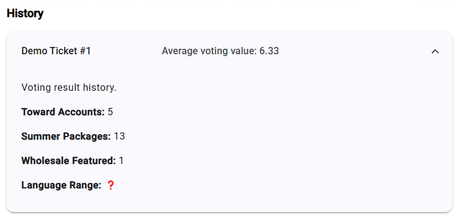

# Open Planning Poker

🌍 [Project website.](https://openplanningpoker.com)

This document represents a project specification of the Open Planning Poker solution. Topics to cover are:
- What is Open Planning Poker?
- Technical implementation of Open Planning Poker.
- System design of the whole solution.
- How to run locally.
- How to access online.

## What is Open Planning Poker?

Open Planning Poker is a free and open-source solution that implements one of the ways how to plan and estimate effort.
The idea is simple, you have to import or write all the user stories/features/tasks and during the 'poker' sessions you have to discuss about the scope and effort of each item as a team.
The next step is **voting** where you have to assign a complexity value for the discussed story. When the voting is finished, an average value is calculated and then you can argue if the average value is acceptable or to vote again.

Open Planning Poker provides you with an easy option to:
- Create a poker room.
- Import or add stories/features/tasks manually.
- Voting mechanism.
- Export results.

## Screenshots

### Main screen

### Game History

## System design

### High-Level Architecture

### Data Model

## Technical implementation

This product has a few services:
- Presentational website
- Frontend Application
- GraphQL Gateway
- User Management
- Game Engine
- Shared NuGet
- Monitoring Services

## How To

### Run Open Planning Poker locally

- Windows: execute `run-game-locally.ps1`
- Linux: execute `run-game-locally.sh`

### Access Open Planning Poker online

You can access the app by visiting this [link.](https://openplanningpoker.com)

## License

Project is under [GNU General Public License](https://github.com/bokunda/open-planning-poker/blob/main/LICENSE)
