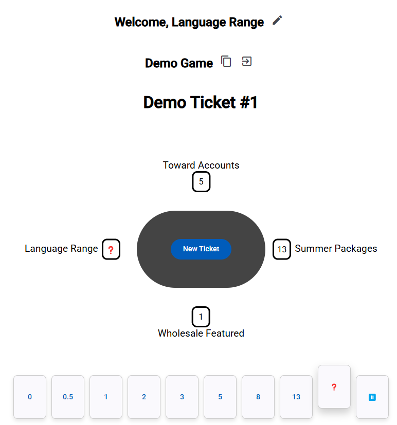

# Open Planning Poker

🌍 [Project Website](https://openplanningpoker.com) &nbsp;|&nbsp; 🎮 [Play Now](https://app.openplanningpoker.com)

[](LICENSE)
[](CONTRIBUTING.md)
[](https://dotnet.microsoft.com/)
[](https://angular.dev/)
[](https://chillicream.com/)

**Open Planning Poker** is a free and open-source agile estimation tool for Scrum teams. Create game rooms, invite your team, estimate user stories collaboratively, and export results — all in real-time.

## ✨ Features

- 🏠 **Create & Join Poker Rooms** — Start a game and share the link with your team
- 🎴 **Classic Planning Poker Voting** — Estimate user stories using Fibonacci, T-shirt sizes, or custom decks
- 👻 **Hidden Votes** — Votes are concealed until the team is ready to reveal them
- ⚡ **Real-Time Updates** — GraphQL WebSocket subscriptions for instant vote and player updates
- 📊 **Export Results** — Download game reports as PDF
- 🔒 **No Registration Required** — Anonymous usernames, no passwords, no personal data
- 📱 **PWA Support** — Installable on mobile and desktop, works offline
- 🔍 **SEO Optimized** — Server-side rendering, structured data, meta tags for search engines
- 🐳 **Docker Ready** — Run locally or deploy to production with Docker Compose
- 🛡️ **Rate Limiting & Security Headers** — Protected by design
- 📈 **Monitoring** — OpenTelemetry, Prometheus, Loki, and Grafana dashboards

## 📖 Documentation

| Document | Description |
|----------|-------------|
| [Architecture](docs/architecture.md) | System design, service matrix, data flow, Clean Architecture layers |
| [Setup & Development](docs/setup-and-development.md) | Prerequisites, local setup, project structure, env vars, tests |
| [Deployment](docs/deployment.md) | Production deployment, CI/CD, nginx, SSL, firewall, rollback |
| [SEO & Analytics](docs/seo-and-analytics.md) | SEO features, structured data, sitemap, GA4, Clarity |
| [Contributing](CONTRIBUTING.md) | How to contribute, coding standards, PR checklist |
| [Security](SECURITY.md) | Vulnerability reporting, security features, known limitations |
| [Changelog](CHANGELOG.md) | Release history and changes |
| [Code of Conduct](CODE_OF_CONDUCT.md) | Community standards |

## 🏗️ Architecture

Open Planning Poker follows a **microservices architecture with GraphQL Federation**:

```
Browser → Nginx (SSL) → API Gateway (YARP) → Fusion Gateway → GraphQL Subgraphs
                                                                    ├── Game Engine (PostgreSQL)
                                                                    └── User Management (Redis)
```

See the [Architecture documentation](docs/architecture.md) for the full system design, service responsibility matrix, and data flow diagrams.

## 🚀 Quick Start

```bash
# Clone the repo
git clone https://github.com/bokunda/open-planning-poker.git
cd open-planning-poker

# Start infrastructure (PostgreSQL + Redis)
docker compose up -d opp-db OpenPlanningPoker.Cache

# Start backend services
cd backend/open-planning-poker-api-gateway && dotnet run           # Terminal 1 — API Gateway :11000
cd backend/open-planning-poker-game-engine/src/OpenPlanningPoker.GameEngine.GraphQL && dotnet run  # Terminal 2 — Game Engine :9091
cd backend/open-planning-poker-user-management/src/OpenPlanningPoker.UserManagement.GraphQL && dotnet run  # Terminal 3 — User Mgmt :9090
cd backend/open-planning-poker-graphql-gateway && dotnet run      # Terminal 4 — Fusion Gateway :10010

# Start frontend
cd frontend/open-planning-poker-web-app && npm install && npm start   # Angular dev server :4200
```

Full setup guide: [docs/setup-and-development.md](docs/setup-and-development.md)

## 📸 Screenshots

### Main Screen



### Game History


## 🛠️ Technology Stack

| Layer | Technology |
|-------|-----------|
| **Frontend** | Angular 19, TypeScript, Angular Material, Apollo Client, SCSS |
| **Backend** | .NET 9, HotChocolate GraphQL, MediatR, Entity Framework Core |
| **Gateway** | YARP Reverse Proxy, HotChocolate Fusion |
| **Database** | PostgreSQL 15.5 |
| **Cache** | Redis 7 |
| **Monitoring** | OpenTelemetry, Prometheus, Loki, Grafana |
| **Infrastructure** | Docker, Nginx, GitHub Actions, Let's Encrypt |
| **Shared** | OpenPlanningPoker.Shared NuGet package |

## 🗺️ Roadmap

- [ ] Import user stories from CSV / Jira
- [ ] Multiple deck types (Fibonacci, T-shirt sizes, custom)
- [ ] Advanced game settings (voting time limits, break rounds)
- [ ] User accounts with history
- [ ] Dark mode theme
- [ ] WebP image optimization
- [ ] Multi-language support (i18n)

## 📄 License

This project is licensed under the [GNU General Public License v3.0](LICENSE).

---

Built with ❤️ by [Bojan Piskulic](https://github.com/bokunda)

