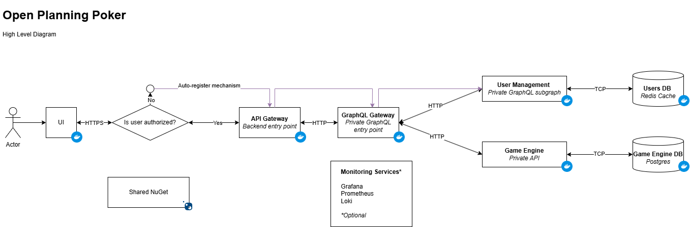

# Open Planning Poker

[Project website.](https://openplanningpoker.com)

This document represents a project specification of the Open Planning Poker solution. Topics to cover are:
- What is Open Planning Poker?
- Technical implementation of Open Planning Poker.
- System design of the whole solution.
- How to run locally.
- How to access online.

## What is Open Planning Poker?

Open Planning Poker is a free and open-source solution that implements one of the ways how to plan and estimate effort.
The idea is simple, you have to import or write all the user stories/features/tasks and during the 'poker' sessions you have to discuss about the scope and effort of each item as a team.
The next step is **voting** where you have to assign a complexity value for the discussed story. When the voting is finished, an average value is calculated and then you can argue if the average value is acceptable or to vote again.

Open Planning Poker provides you with an easy option to:
- Create a poker room.
- Import or add stories/features/tasks manually.
- Voting mechanism.
- Export results.

## System design

### High-Level Architecture

### Data Model

Work in progress.

## Technical implementation

This product has a few services that are in separate repositories:
- Presentational website
- Frontend Application
- [YARP API Gateway](https://github.com/bokunda/open-planning-poker-api-gateway)
- [GraphQL Facade](https://github.com/bokunda/open-planning-poker-game-graphql)
- User Management
- [Game Engine](https://github.com/bokunda/open-planning-poker-game-engine)
- Reporting Service
- Notification Service

## How To

### Run Open Planning Poker locally

Unfortunately, this option is not available yet.

### Access Open Planning Poker online

You can access the app by visiting this [link.](https://openplanningpoker.com)
