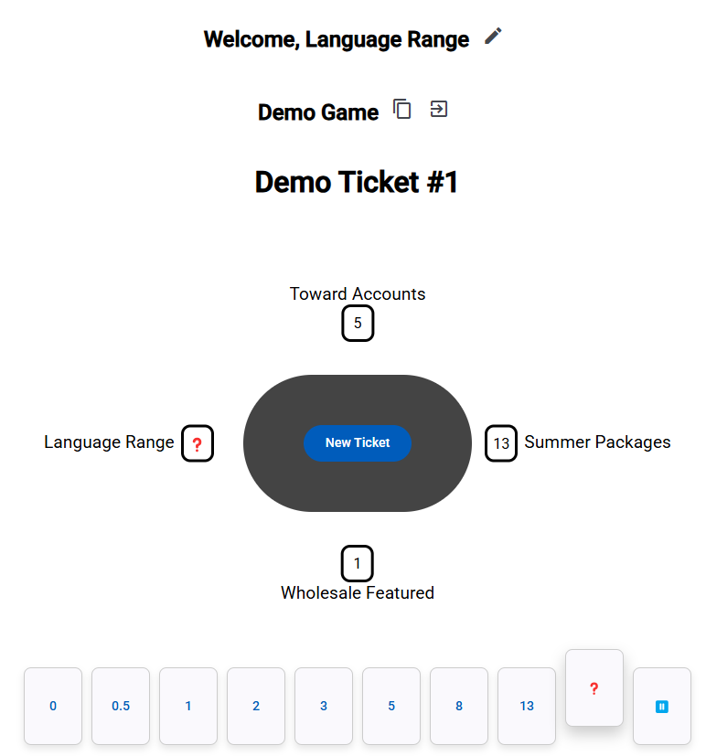
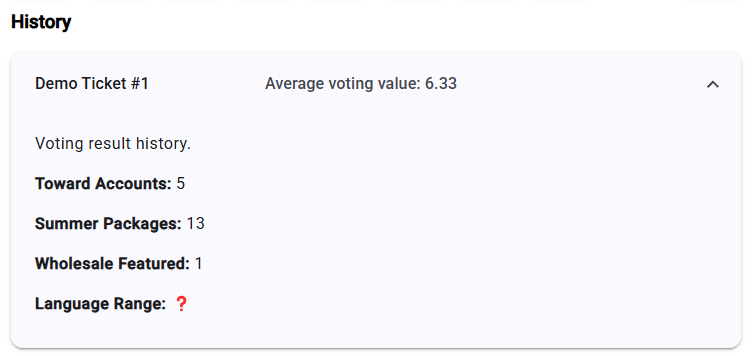

# Open Planning Pokger - Web Game

Web Application for Open Planning Poker game.

## Description

[Angular 19](https://blog.angular.dev/meet-angular-v19-7b29dfd05b84) is used to create the app.

Important dependencies:
- [Angular Material](https://material.angular.io/)
- [Apollo GraphQL Client](https://the-guild.dev/graphql/apollo-angular/docs)
- [graphql-ws](https://the-guild.dev/graphql/ws)
- [Fontawesome](https://fontawesome.com/)

## Getting started

You can run application using [Docker](https://docs.docker.com/engine/install/) or directly on you machine using [Node.js](https://nodejs.org/en/).

### Local run

Make sure you have installed [Angular 19](https://blog.angular.dev/meet-angular-v19-7b29dfd05b84).

```
# Install node modules
npm install

# Start the application
ng s -o
```

Application will be running on 4200 port.

### Docker run

```
# Build image
docker build -t open-planning-poker-web-app .

# Start container
docker run --name open-planning-poker-web-app -d -p 4200:80 open-planning-poker-web-app

# Stop container
docker stop open-planning-poker-web-app

# Remove container
docker rm open-planning-poker-web-app

# Remove image 
docker rmi open-planning-poker-web-app
```

Application will be running on 4200 port.

## Screenshots

### Main screen


### Game History

