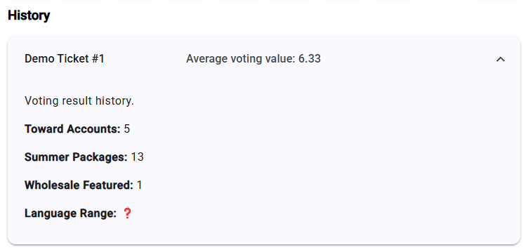

# Open Planning Pokger - Web Game

Web Application for Open Planning Poker game.

## Description

[Angular 19](https://blog.angular.dev/meet-angular-v19-7b29dfd05b84) is used to create the app.

Important dependencies:
- [Angular Material](https://material.angular.io/) with custom purple theme (#7e3af2)
- [Apollo GraphQL Client](https://the-guild.dev/graphql/apollo-angular/docs)
- [graphql-ws](https://the-guild.dev/graphql/ws) for real-time subscriptions
- [Fontawesome](https://fontawesome.com/)
- [QRCode](https://www.npmjs.com/package/qrcode) for game sharing

## Features
- **Multiple Voting Decks**: Fibonacci, Modified Fibonacci, T-Shirt Sizes, Powers of 2, Custom
- **Dark Mode**: System preference detection + manual toggle
- **Game Timer**: 60-second countdown with auto-reveal (host only)
- **Chat/Discussion**: Real-time ephemeral chat via GraphQL subscriptions (Redis pub-sub)
- **QR Code Sharing**: Share game URL via QR code
- **Voting Consensus**: "X/Y voted" indicator
- **Hidden Votes**: Votes hidden until host reveals
- **PDF Game Reports**: Export game results as PDF

## Getting started

You can run application using [Docker](https://docs.docker.com/engine/install/) or directly on you machine using [Node.js](https://nodejs.org/en/).

### Local run

Make sure you have installed [Angular 19](https://blog.angular.dev/meet-angular-v19-7b29dfd05b84).

```
# Install node modules
npm install

# Start the application
ng s -o
```

Application will be running on 4200 port.

### Docker run

```
# Build image
docker build -t open-planning-poker-web-app .

# Start container
docker run --name open-planning-poker-web-app -d -p 4200:80 open-planning-poker-web-app

# Stop container
docker stop open-planning-poker-web-app

# Remove container
docker rm open-planning-poker-web-app

# Remove image 
docker rmi open-planning-poker-web-app
```

Application will be running on 4200 port.

## Screenshots

### Main screen


### Game History

