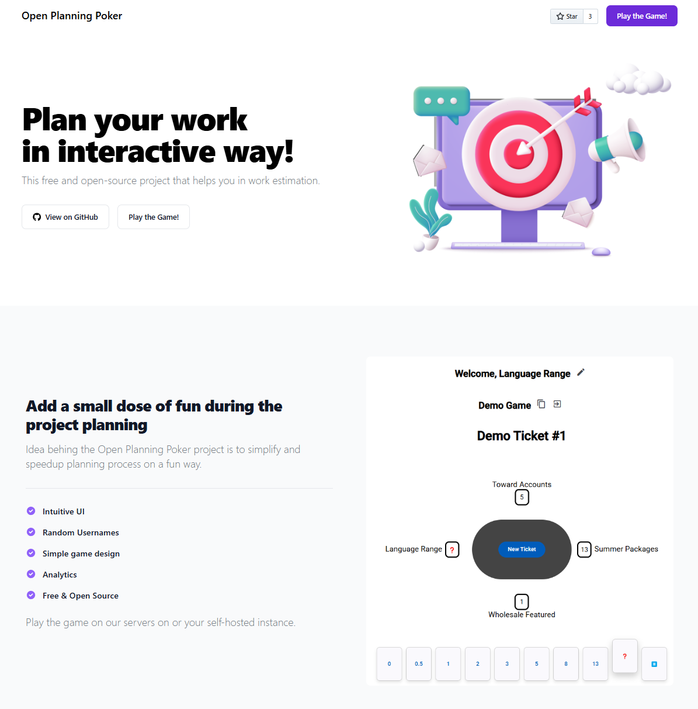

# Open Planning Poker - Website

This is a presentational website of Open Planning Poker project.
For mor details visit the main [Open Planning Poker page](https://github.com/bokunda/open-planning-poker).

🌍 [Project website.](https://openplanningpoker.com)

## Description

Initial design used from [landwind](https://github.com/themesberg/landwind) open-source project.

## Tech stack
- [HTML](https://developer.mozilla.org/en-US/docs/Web/HTML)
- [CSS](https://developer.mozilla.org/en-US/docs/Web/CSS)
- [Tailwind CSS](https://tailwindcss.com/)
- [JavaScript](https://developer.mozilla.org/en-US/docs/Web/JavaScript)

## Getting started

Make sure that you have [Node.js](https://nodejs.org/en/), [Tailwind CSS](https://tailwindcss.com/docs/installation) and [Flowbite](https://flowbite.com/docs/getting-started/quickstart/) installed.

1. Run `npm install` inside your terminal

2. Watch for files and compile Tailwind CSS + Flowbite:

```
npx tailwindcss -i ./input.css -o ./output.css --watch
```

3. To deploy you will only need the `index.html` file and the `output.css` styles.

## Screenshot

